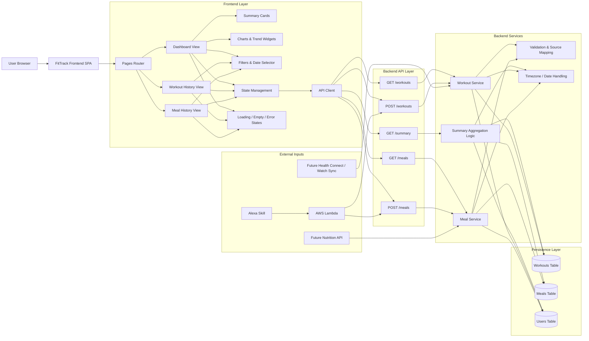

# FitTrack Frontend

FitTrack Frontend is the user-facing web application for the FitTrack project. It provides a dashboard for viewing workouts, meals, and daily calorie summaries while consuming the FitTrack backend API hosted on Render.[cite:95][cite:96]

## Project Planning
Project planning and architecture for the FitTrack system are maintained in an Obsidian vault. The vault includes dedicated notes for the backend API, Alexa integration, frontend UI, and overall roadmap, with heavy cross-linking between them. This README summarizes the backend-specific parts of that Obsidian plan so the repository stays aligned with the broader project design.

## Frontend Architecture



## How the Frontend Fits Into the System

The frontend is the visual layer of FitTrack. It is responsible for turning backend workout, meal, and summary data into a usable dashboard, history views, and trend components. While Alexa is the voice input layer, the frontend is the place where the user can review, validate, and analyze the logged data.

The expected data flow is:

1. The user opens the frontend in the browser.
2. The frontend router loads the dashboard, workouts, or meals view.
3. Page-level components call the API client.
4. The API client requests summary, workout, and meal data from the backend.
5. The backend aggregates data from the database and returns structured JSON.
6. The frontend renders summary cards, filters, charts, and history tables.

## Overview

The frontend is part of a larger system where Alexa logs workouts and meals through AWS Lambda, the backend stores and summarizes the data, and the frontend presents that information in a usable dashboard.[cite:95]

## Project Purpose

The purpose of the frontend is to give a visual interface for the same health data that is being logged through voice and stored through the backend API.[cite:95]

Primary goals:
- Show daily calories burned, calories eaten, and net calories.[cite:95]
- Show logged workouts and meals in a structured UI.[cite:95]
- Serve as the main dashboard for reviewing progress beyond Alexa voice responses.[cite:95]

## Repository

- GitHub repository: <https://github.com/atharvamavle/fittrack-frontend>[cite:96]

## System Context

The frontend depends on the FitTrack backend API, which is hosted at `https://fittrack-backend-i1db.onrender.com/api`.[cite:95] The backend exposes endpoints for workouts, meals, and summaries, and the frontend is expected to consume those endpoints for rendering the dashboard and lists.[cite:95]

## Current Project State

Based on the current project documentation, the frontend exists as a separate repository and is intended to provide a dashboard and UI for the FitTrack system.[cite:96] The detailed project plan identifies the frontend as the place for dashboard views, workouts lists, meals lists, and future summary visualization.[cite:95]

Known frontend direction:
- Dashboard for today or weekly summary.[cite:95]
- Workout list and filters.[cite:95]
- Meal list and nutrition summary.[cite:95]
- Future charts or macro breakdown once backend data is stable.[cite:95]

## Suggested Features

### Dashboard
- Today summary cards: burned, eaten, net calories.
- Date selector for previous summaries.
- Weekly trend section.

### Workouts
- List of workouts.
- Duration, workout type, calories, and source.
- Filter by date or type.

### Meals
- List of meals.
- Calories and macro display once nutrition parsing is implemented.[cite:95]

### Status and Error States
- Loading skeletons while fetching API data.
- Empty states when no workouts or meals exist.
- Error banners when the backend is unavailable.

## Expected API Usage

The frontend is expected to integrate with these backend routes from the project plan:[cite:95]

| Endpoint | Method | Purpose |
|---|---|---|
| `/workouts` | GET / POST | Read or create workouts |
| `/meals` | GET / POST | Read or create meals |
| `/summary` | GET | Fetch calories burned, eaten, and net |

If the current backend does not yet expose GET list routes for workouts or meals, those should be added or documented explicitly.[cite:95]

## Known Project Issues Affecting Frontend

The frontend is blocked by some backend correctness issues already documented in the project plan.[cite:95]

### 1. Timezone mismatch
Alexa logs can be stored on the wrong day because Lambda runs in UTC while the user operates in AEST, which makes the frontend show misleading daily summaries unless the backend date logic is fixed.[cite:95]

### 2. Incorrect source mapping
Workout rows logged from Alexa may appear as Manual instead of Alexa, so the frontend can only display what the backend stores until that source bug is fixed.[cite:95]

### 3. Meal data is incomplete
Meal logging currently uses placeholder values rather than real nutrition parsing, so frontend meal totals and summary cards may be misleading until nutrition API support is added.[cite:95]

## Recommended Frontend Structure

A realistic frontend structure for this project would look like this:

```text
src/
  components/
    SummaryCard/
    WorkoutTable/
    MealTable/
    DateFilter/
    EmptyState/
    ErrorBanner/
  pages/
    Dashboard/
    Workouts/
    Meals/
  services/
    api.js
  hooks/
    useSummary.js
    useWorkouts.js
    useMeals.js
  utils/
    formatDate.js
    formatCalories.js
```

## Recommended Environment Variables

```env
VITE_API_BASE_URL=https://fittrack-backend-i1db.onrender.com/api
```

If the project uses Next.js instead of Vite, rename the variable convention accordingly.

## Getting Started

Because the exact frontend stack is not documented in the project plan, these commands are placeholders and should be adjusted to the actual package manager and framework used.

```bash
git clone https://github.com/atharvamavle/fittrack-frontend.git
cd fittrack-frontend
npm install
npm run dev
```

## Recommended Development Tasks

Short-term priorities from the project plan that directly affect the frontend:[cite:95]
- Build a usable dashboard for today and the last 7 days.[cite:95]
- Connect summary cards to the backend summary endpoint.[cite:95]
- Add workout and meal listing pages.[cite:95]
- Add basic filters and date selection.[cite:95]

## Roadmap Alignment

The frontend should evolve in this order based on the current project priorities:[cite:95]

1. Show correct same-day summary once timezone logic is fixed.[cite:95]
2. Display correct source labels once backend source mapping is fixed.[cite:95]
3. Add meal nutrition and macro summaries once nutrition API integration is complete.[cite:95]
4. Add authentication and user-specific dashboards after account linking and user identity are implemented.[cite:95]

## Contribution Notes

Before building extra UI complexity, stabilize the data model first. A polished dashboard built on wrong dates, wrong sources, or fake meal calories is wasted effort.[cite:95]
